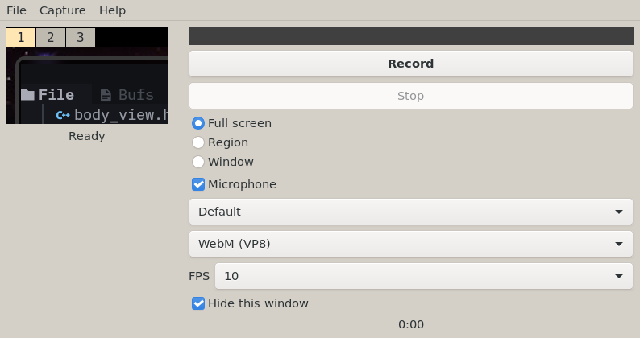

# Tally

**Vended by Grok Build**



A **screen recorder** for The Lunduke Computer Operating System (LCOS). The window is HyperCam, not OBS.

Binary: `tally`. Unlicense. Needs `ffmpeg` on PATH.

LCOS itself: [https://github.com/BryanLunduke/LCOS](https://github.com/BryanLunduke/LCOS)

## Status

**v0.3.3.** Full screen, region, or window to WebM, AVI, MP4, or MKV. Optional audio source, FPS, default folder, hide while recording. Headless test suite and BUG-BACKLOG.md. See [INSTALL.md](INSTALL.md) and [DEVELOPMENT.md](DEVELOPMENT.md).

| Doc | What |
|---|---|
| [DEVELOPMENT.md](DEVELOPMENT.md) | Locked decisions, architecture, milestones, branching, semver, lint |

## Build

```
sudo apt install build-essential meson ninja-build pkg-config g++ libgtkmm-3.0-dev ffmpeg clang-format cppcheck
meson setup build
meson compile -C build
./build/tally
```

PR lint gate: `./scripts/lint.sh` (CI runs this; no `--fix`). Format `src/` locally with `./scripts/lint.sh --fix`.

## License

[The Unlicense](https://unlicense.org). See [UNLICENSE](UNLICENSE).
